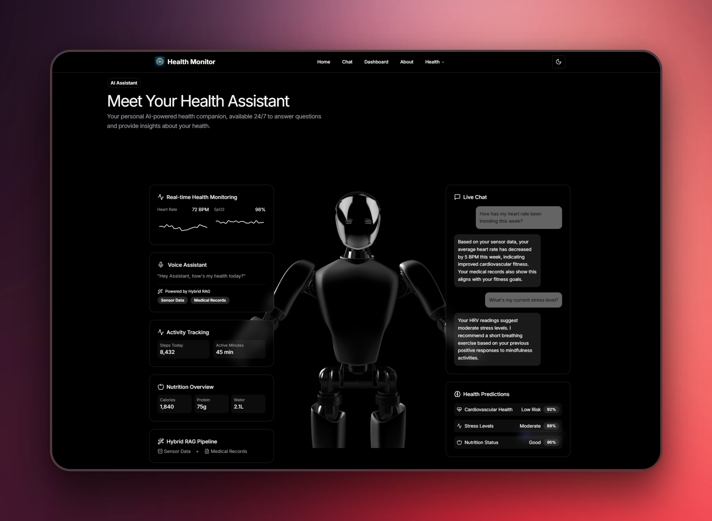
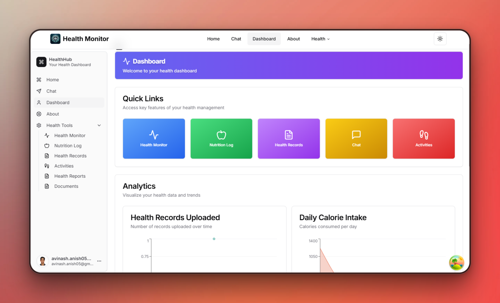
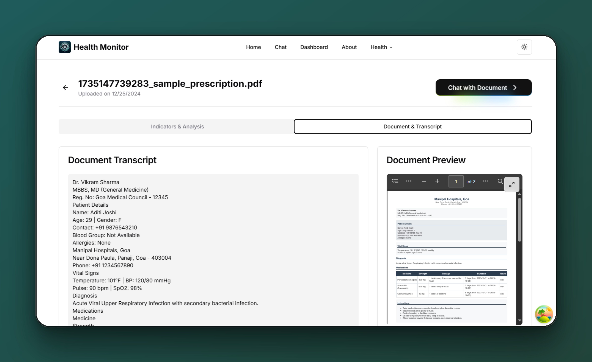
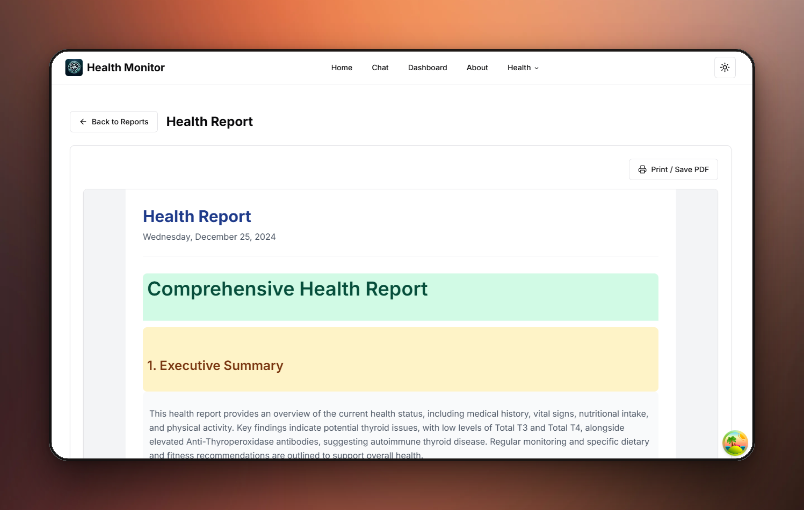

# HealthHub: Health Data Management and AI-Assisted Analysis Platform

This project is a comprehensive health data management and AI-assisted analysis platform. It combines personal health record management with advanced AI capabilities for data analysis and medical information retrieval.

## Platform Overview




### AI-Powered Health Assistant

Health assistant powered by a RAG pipeline using Langchain.


Video assistant powered by HeyGen.

### Real-Time Health Dashboard

Overview of your health metrics, vitals, and analytics in one unified interface.

### Medical Records & Analysis


Secure storage and vectorization of your medical records with automatic transcription.

### Health Monitoring & Activities


Track vital signs in real-time and monitor your daily activities and fitness progress.

### Nutrition & Health Reports


Monitor your nutrition and generate comprehensive health reports for healthcare providers.

## Features

### Real-time Health Data Integration
- Integration of Arduino sensors for vital signs monitoring
- Live dashboard updates via ESP8266 and Supabase
- Structured data collection and analysis for health trends

### Comprehensive Health Records Management
- Secure upload and storage of personal health records
- Automatic transcription of medical records (PDF and images)
- Creation of embeddings from transcribed text using Cohere
- Intelligent file organization with preview and download options

### Advanced AI Assistant Capabilities
- Multi-modal interaction with voice and text interfaces
- Gemini 2.0 powered voice recognition and response
- HeyGen AI video assistant for personalized health guidance
- Support for multiple language models (OpenAI GPT-4, Gemini)
- Conversation history management and context retention

### RAG (Retrieval-Augmented Generation) Pipeline
- Combines structured sensor data and unstructured medical records
- Utilizes Langchain for efficient document processing and retrieval
- Implements Cohere embeddings for semantic understanding
- Enhances AI responses with personalized health context
- Real-time integration of sensor data in responses

### Medical Knowledge Integration
- Perplexity-style medical search using Tavily API
- Up-to-date medical information from verified sources
- Source attribution and relevance ranking
- AI-generated comprehensive health reports


## Tech Stack

- Frontend: Next.js with TypeScript
- Backend: FastAPI (Python)
- Database: Supabase (PostgreSQL with pgvector extension)
- AI/ML: Langchain, OpenAI API, Cohere embeddings
- External APIs: Tavily for medical web search

## Getting Started

### Prerequisites
- Node.js (v14 or later)
- Python (v3.8 or later)
- Supabase account
- OpenAI API key
- Gemini API key
- Tavily API key
- Cohere API key
- Resend API key
- Nutritionix API key

### Installation

1. Clone the frontend repository:
   ```bash
   git clone https://github.com/CubeStar1/health-monitor-next.git
   cd health-monitor-next
   ```

2. Install frontend dependencies:
   ```bash
   npm install
   ```

3. Clone the Python backend repository:
   ```bash
   git clone https://github.com/CubeStar1/health-monitor-api.git
   cd healthhub-backend
   ```

4. Set up the Python backend:
   ```bash
   python -m venv venv
   source venv/bin/activate  # On Windows use `venv\Scripts\activate`
   pip install -r requirements.txt
   ```

5. Set up environment variables:
   Create a `.env` file in the frontend root directory and a `.env` file in the backend directory with the following contents:

   ```bash
   # Frontend .env (in health-monitor-next directory)

   # Supabase
   NEXT_PUBLIC_SUPABASE_URL=your_supabase_project_url
   NEXT_PUBLIC_SUPABASE_ANON_KEY=your_supabase_anon_key
   SUPABAE_ADMIN=your_supabase_service_role_key

   # FastAPI
   NEXT_PUBLIC_API_URL=http://localhost:8000
   API_URL=http://localhost:8000

   # Resend
   RESEND_API_KEY=your_resend_api_key
   RESEND_DOMAIN=your_resend_domain

   # Nutritionix API
   NUTRITIONIX_API_URL=https://trackapi.nutritionix.com/v2
   NUTRITIONIX_APP_ID=your_nutritionix_app_id
   NUTRITIONIX_API_KEY=your_nutritionix_api_key

   # DB Credentials
   NEXT_PUBLIC_DB_USER=<your_db_user>
   NEXT_PUBLIC_DB_PASSWORD=<your_db_password>
   NEXT_PUBLIC_DB_HOST=<your_db_host>
   NEXT_PUBLIC_DB_PORT=<your_db_port>
   NEXT_PUBLIC_DB_NAME=<your_db_name>


   # Backend .env (in health-monitor-api directory)
   OPENAI_API_KEY=<your_openai_api_key>
   LOCAL_LLM_URL=<your_local_llm_url>
   GOOGLE_API_KEY=<your_google_api_key>
   COHERE_API_KEY=<your_cohere_api_key>
   TAVILY_API_KEY=<your_tavily_api_key>

   SUPABASE_URL=<your_supabase_project_url>
   SUPABASE_KEY=<your_supabase_service_role_key>

   ```


6. Start the development servers:
   ```bash
   # In the frontend directory
   cd health-monitor-next
   npm run dev

   # In a new terminal, navigate to the backend directory
   cd path/to/health-monitor-api
   uvicorn main:app --reload
   ```

## Usage

1. Upload health records through the Health Records interface
2. Use the Chat interface to query your health data or ask medical questions
3. Utilize the Medical Search feature for up-to-date medical information

## Medical Records Processing

When a medical record is uploaded:

1. The file is sent to the backend for processing.
2. If it's a PDF, it's converted to text using PyPDF2. If it's an image, OCR is performed using Tesseract.
3. The extracted text is then sent to Cohere to generate embeddings.
4. The embeddings, along with the original text and metadata, are stored in the Supabase vector database.

This process allows for efficient semantic search and retrieval of relevant information during chat interactions.

